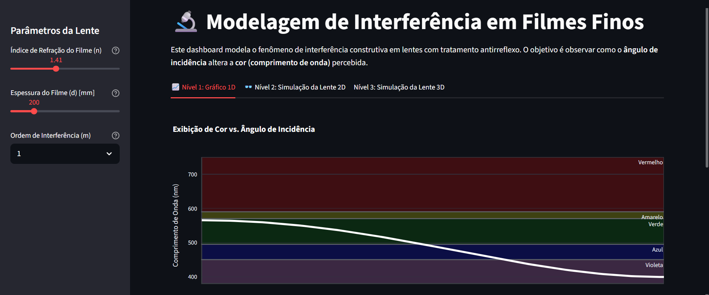
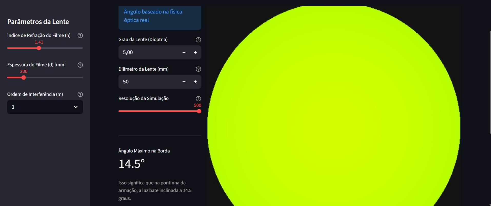
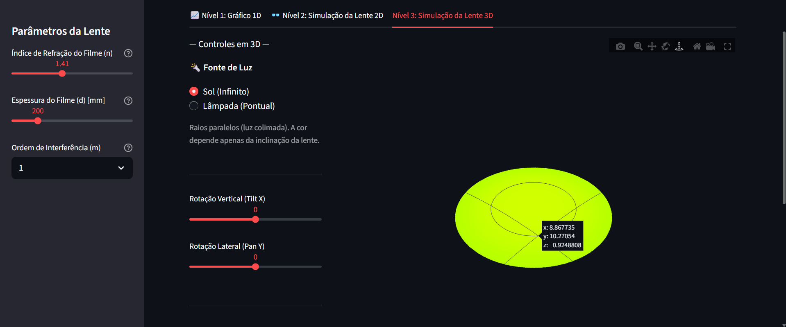
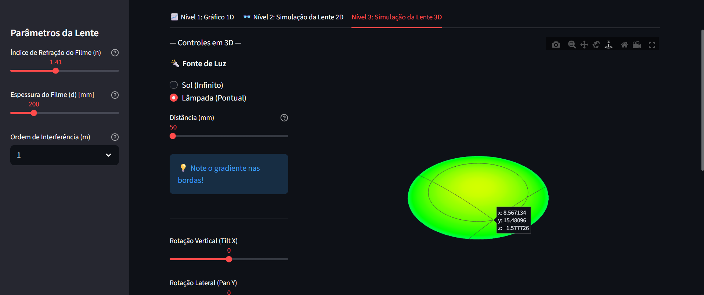

# 🔭 Thin Film Interference Modeling

> Simulação computacional avançada para análise de interferência de filmes finos em lentes antirreflexo e superfícies ópticas.

## 📄 Sobre o Projeto

Este projeto consiste em uma ferramenta de **Modelagem Computacional** desenvolvida para simular o fenômeno físico da interferência de filmes finos em lentes. Utilizando princípios de óptica ondulatória e geométrica, a aplicação permite visualizar como a espessura do revestimento, o índice de refração e a geometria da lente influenciam na coloração refletida (fenômeno conhecido como *Newton's Rings* ou iridescência).

O simulador foi desenhado para transitar desde a teoria fundamental (1D) até um "Gêmeo Digital" completo (3D) que considera fatores complexos como fontes de luz pontuais e curvatura da superfície.

### 🎯 Objetivos e Aplicações

Esta ferramenta foi projetada com foco em aplicações práticas para Engenharia e Pesquisa:

* **Indústria Óptica (Controle de Qualidade):** Identificação visual de falhas na uniformidade de deposição de filmes antirreflexo.
* **Robótica Móvel e Visão Computacional:** Auxílio no ajuste de lentes para sensores, mitigando ruídos causados por reflexos especulares ("glare") que cegam robôs autônomos.
* **Educação e Pesquisa:** Ferramenta visual para ensino de Óptica Física e estudo de propriedades de materiais.

---

## 🚀 Funcionalidades (Níveis de Simulação)

A aplicação é dividida em níveis de complexidade crescente:

### 🔹 Nível 1: Interferência Fundamental (1D)
Simulação teórica da interação luz-matéria.
* Cálculo do **Comprimento de Onda Construtivo** baseado na equação de interferência.
* Análise da relação Espessura do Filme vs. Cor Percebida.

### 🔹 Nível 2: Mapeamento de Superfície (2D)
Expansão para uma matriz bidimensional que simula a superfície de uma lente.
* Visualização de padrões de interferência em lentes planas e curvas.
* Simulação do efeito de gradiente de cor do centro para as bordas devido à curvatura.

### 🔹 Nível 3: Gêmeo Digital Interativo (3D)
Modelagem tridimensional completa utilizando a biblioteca Plotly.
* Renderização 3D da lente com controles de rotação (Tilt/Pan).
* Mapeamento preciso das Normais da superfície para cálculo vetorial da incidência de luz.
* Simulação avançada de diferentes tipos de iluminação.
* **Luz Colimada (Sol):** Raios paralelos (Interferência de Campo Distante).
* **Fonte Pontual (Lâmpada):** Cálculo da divergência dos raios de luz baseada na distância da fonte, gerando fenômenos realistas de "Blue Shift" nas bordas e distorções cromáticas dependentes da posição do observador.

---

## 🛠️ Tecnologias Utilizadas

O projeto foi desenvolvido inteiramente em **Python**, utilizando bibliotecas de alta performance para cálculo numérico e visualização de dados.

* **[Python 3.12.0](https://www.python.org/):** Linguagem base e orquestração lógica.
* **[Streamlit](https://streamlit.io/):** Framework para criação da interface web interativa e dashboard de controle.
* **[NumPy](https://numpy.org/):** Computação vetorial para cálculos matriciais de óptica e geometria analítica (evitando loops lentos).
* **[Plotly](https://plotly.com/python/):** Renderização gráfica 3D interativa e manipulação de malhas (meshes).

---

## 📸 Screenshots

| Simulação 1D (Relação do ângulo de inclinação da lente e comprimento de onda)
|:---:|:---:|
|  |

| Simulação 2D (Análise do Ângulo Máximo de Borda)
|:---:|:---:|
|  |

| Simulação 3D (Luz do Sol)
|:---:|:---:|
|  |

| Simulação 3D (Lâmpada em 50 mm de distância da lente)
|:---:|:---:|
|  |

---

## 💻 Como Rodar o Projeto Localmente

### Pré-requisitos
Certifique-se de ter o [Python](https://www.python.org/downloads/) e o [Git](https://git-scm.com/) instalados.

1. **Clone o repositório:**
   ```bash
   git clone [https://github.com/Joao-Victor0/thin_film_interference_modeling.git](https://github.com/Joao-Victor0/thin_film_interference_modeling.git)
   cd thin_film_interference_modeling

2. **Crie um ambiente virtual (Recomendado):**
    python -m venv venv

    # No Windows:
    venv\Scripts\activate

    # No Linux/Mac:
    source venv/bin/activate

3. **Instale as dependências:**
    pip install -r requirements.txt

4. **Execute a aplicação:**
    streamlit run app.py
    
5. **Observação**
    O navegador abrirá automaticamente no endereço http://localhost:8501

📝 Autor
João Victor | Estudante de Bacharelado em Ciências Exatas e Tecnológicas e Engenharia de Computação

